# WEB STACK IMPLEMENTATION (LEMP STACK) IN AWS – Project 2

## 📌 Project Overview

This project demonstrates deploying a **LEMP Stack** (Linux, Nginx, MySQL, PHP) on an AWS EC2 Ubuntu Server.

In this project, the main difference is the use of **Nginx** as the web server instead of Apache.

---

## ☔️ AWS Environment Setup

### Step 0 — Preparing Prerequisites

* You need an **AWS account** and an EC2 instance running **Ubuntu Server 24.04 LTS**.
* Launch an EC2 instance of `t2.micro` family.
* Stop other EC2 instances when not in use to save free tier hours.
* Connect via **Git Bash**:

```bash
ssh -i <Your-private-key.pem> ubuntu@<EC2-Public-IP-address>
```

---

## ubuntucomputer Step 1 — Install Nginx

Update your server packages:

```bash
sudo apt update
```

Install Nginx:

```bash
sudo apt install nginx
```

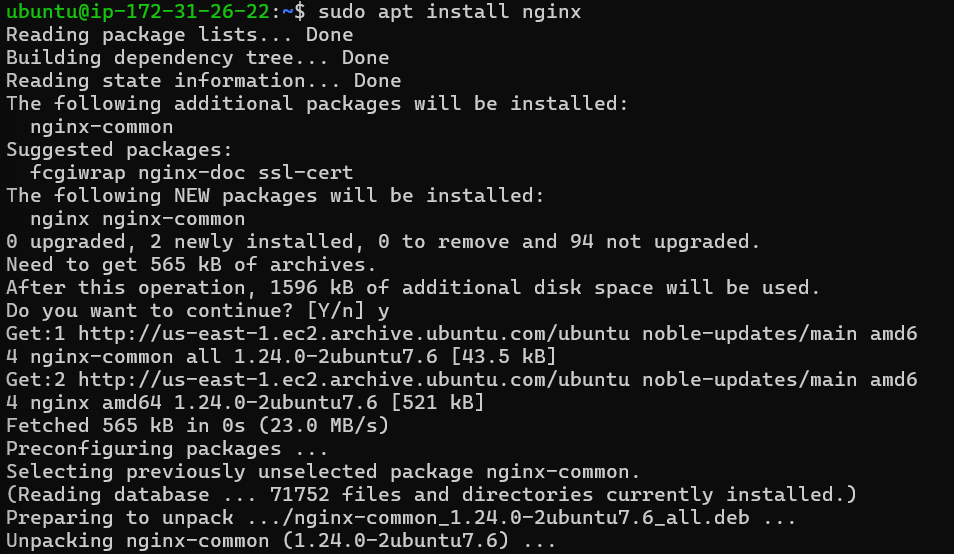

Verify that Nginx is running:

```bash
sudo systemctl status nginx
```

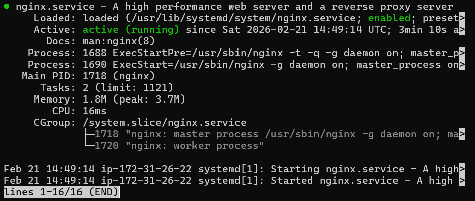

Test Nginx locally:

```bash
curl http://localhost:80
curl http://127.0.0.1:80
```

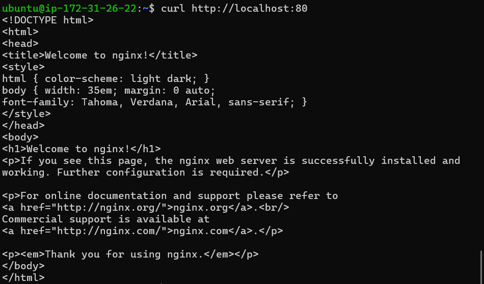

Open port 80 in **AWS Security Group** (Inbound rule: HTTP, Source: 0.0.0.0/0) and test via browser:

```text
http://<Public-IP-Address>:80
```

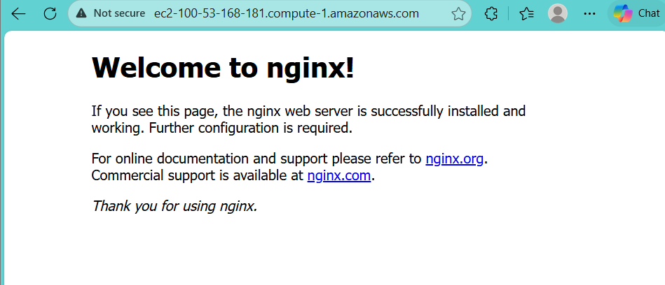

---

## 🛢 Step 2 — Install MySQL

Install MySQL server:

```bash
sudo apt install mysql-server
```

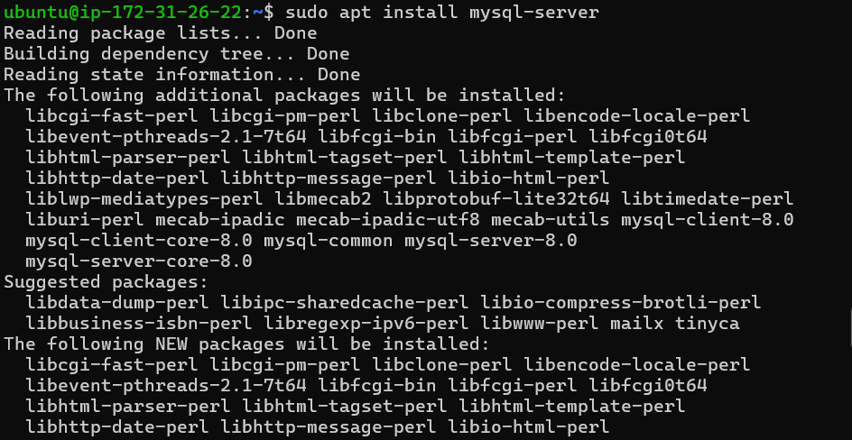

Login as root:

```bash
sudo mysql
```

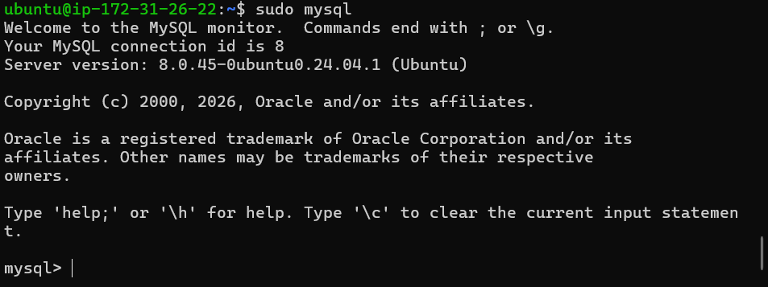

Secure MySQL installation and set root password:

```sql
ALTER USER 'root'@'localhost' IDENTIFIED WITH mysql_native_password BY 'PassWord.1';
sudo mysql_secure_installation
```

Test login:

```bash
sudo mysql -p
```

---

## 🐘 Step 3 — Install PHP

Install PHP and required modules:

```bash
sudo apt install php-fpm php-mysql
```

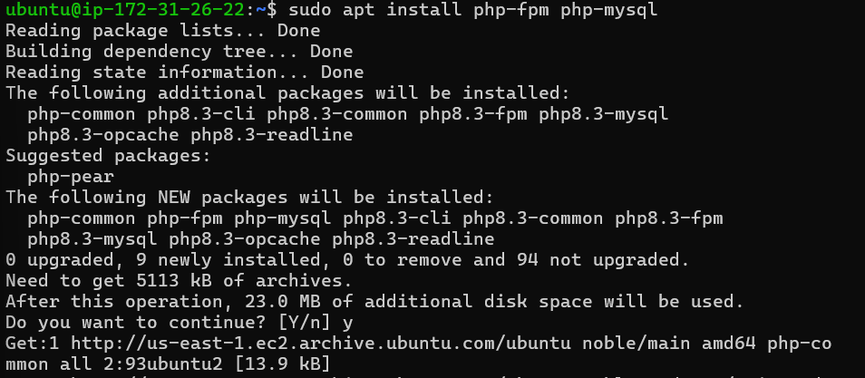

---

## ⚙️ Step 4 — Configure Nginx for PHP

Create your project directory:

```bash
sudo mkdir /var/www/projectLEMP
sudo chown -R $USER:$USER /var/www/projectLEMP
```

Configure Nginx site:

```bash
sudo nano /etc/nginx/sites-available/projectLEMP
```

Add configuration:

```nginx
server {
    listen 80;
    server_name _;
    root /var/www/projectLEMP;

    index index.php index.html index.htm;

    location / {
        try_files $uri $uri/ =404;
    }

    location ~ \.php$ {
        include snippets/fastcgi-php.conf;
        fastcgi_pass unix:/run/php/php8.2-fpm.sock;
    }

    location ~ /\.ht {
        deny all;
    }
}
```

Enable site and reload Nginx:

```bash
sudo ln -s /etc/nginx/sites-available/projectLEMP /etc/nginx/sites-enabled/
sudo nginx -t
sudo systemctl reload nginx
```

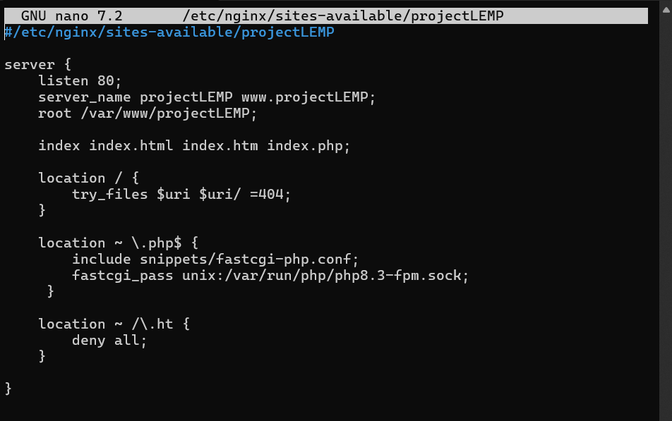
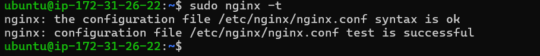

---

## 🗑️ Step 5 — Test PHP with Nginx

Create test PHP file:

```bash
nano /var/www/projectLEMP/info.php
```

Add:

```php
<?php phpinfo(); ?>
```

Access in browser:

```text
http://<Public-IP-Address>/info.php
```

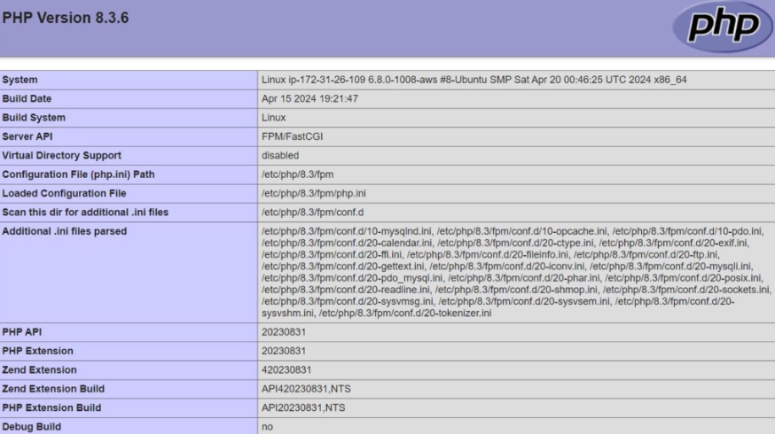

Remove test file:

```bash
sudo rm /var/www/projectLEMP/info.php
```

---

## 🥹 Step 6 — MySQL & PHP Integration

### Create Database and User

```sql
CREATE DATABASE example_database;
CREATE USER 'example_user'@'%' IDENTIFIED WITH mysql_native_password BY 'PassWord.1';
GRANT ALL ON example_database.* TO 'example_user'@'%';
FLUSH PRIVILEGES;
```

### Create Table and Insert Data

```sql
USE example_database;

CREATE TABLE todo_list (
    item_id INT AUTO_INCREMENT,
    content VARCHAR(255),
    PRIMARY KEY (item_id)
);

INSERT INTO todo_list (content) VALUES
('Linux - Operating System'),
('Nginx - Web Server'),
('MySQL - Database Server'),
('PHP - Server-side Scripting');
```

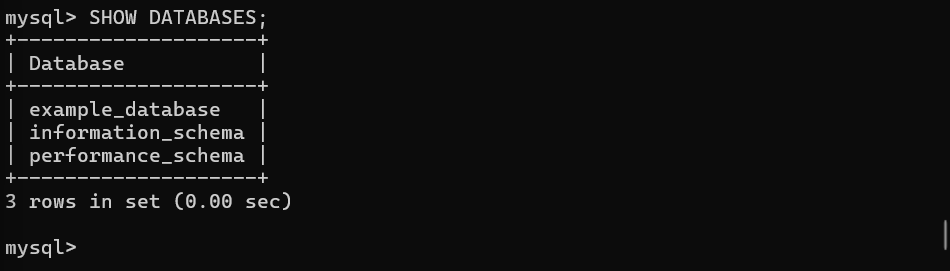
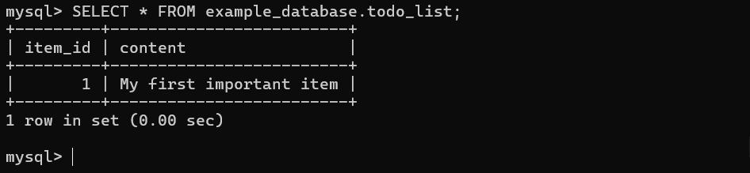

---

### PHP Script to Display TODO List

Create `todo_list.php`:

```bash
nano /var/www/projectLEMP/todo_list.php
```

Add:

```php
<?php
$user = "example_user";
$password = "PassWord.1";
$database = "example_database";
$table = "todo_list";

try {
    $db = new PDO("mysql:host=localhost;dbname=$database", $user, $password);
    echo "<h2>LEMP Stack Components</h2><ol>";
    foreach($db->query("SELECT content FROM $table") as $row) {
        echo "<li>" . $row['content'] . "</li>";
    }
    echo "</ol>";
} catch (PDOException $e) {
    print "Error!: " . $e->getMessage() . "<br/>";
    die();
}
?>
```

Access in browser:

```text
http://<Public-IP-Address>/todo_list.php
```

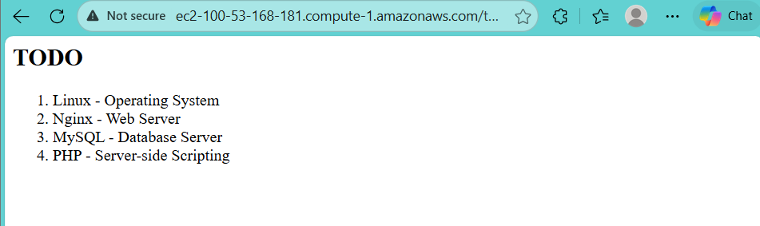

---

## ✅ Project Complete

Your **LEMP stack** is fully operational:

* ☑ Linux (Ubuntu Server)
* ☑ Nginx Web Server
* ☑ MySQL Database
* ☑ PHP-FPM Processor
* ☑ Dynamic PHP web page connected to MySQL

---

## 📎 Notes

* Public IP changes after stopping/starting instance.
* Keep your `.pem` file secure.

---

## 👨‍💻 Author

* Marco Raafat Zakaria
* Steghub Scholarship

---
